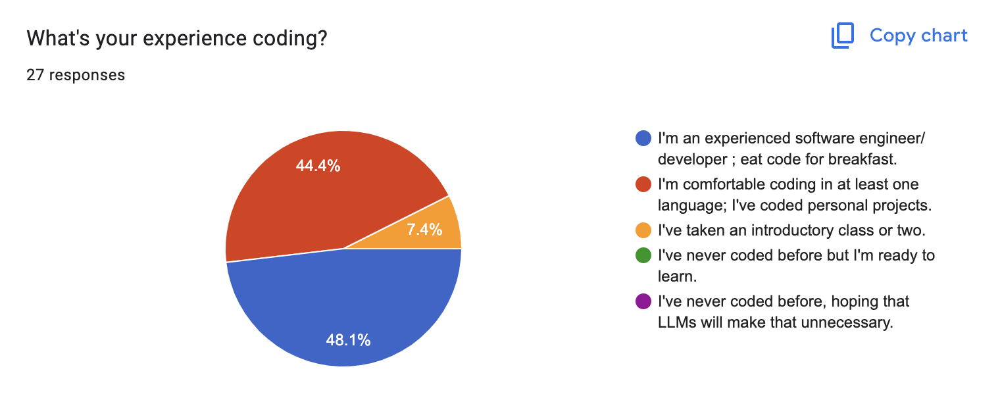

# The Future of Programming?

## Official Course Blurb

> Programming is and always has been specifying the behavior of a machine. In an
> earlier day, people programmed in assembly language, which was eventually
> supplanted by a series of higher level symbolic languages. Today we program
> behaviors of machines ("code") in Java, Javascript, Python, etc. Just as in an
> earlier day assembler was supplanted by higher level languages, today perhaps
> we're on the threshold of another inflection point in programming. We can
> already use ChatGPT to generate code in symbolic languages by specifying
> behavior in natural language (e.g., "write a Python program that sorts an
> array of strings in alphabetical order using an efficient sorting algorithm").
> Success depends on being precise and particular in the natural language
> description. Whereas to date a programmer's skill has been the ability to
> specify behavior within the constraints of symbolic language primitives and
> syntax, perhaps soon the skills needed will be the ability to specify behavior
> in natural language. This experimental class investigates this proposition by
> trying to write complex software using natural language "prompts" , including
> writing unit tests, debugging, all the usual apparatus familiar from
> conventional symbolic language software engineering. How far can we push this?

## Why are we here? How will this go?

AI represents a massive change in how people write code. None of us (instructors
included!) have an accurate understanding of the current state of art, and none
of us can predict what the future holds. These are exciting, possibly scary
times.

This course is meant to provide a context to explore what is possible with new
AI techniques with respect to writing software.

To set your expectations: this is a workshop style course. There will be no
exams or essays. During class we will have lively conversations about what we
find on our exploration: What's out there? Which tools are good at which things?
What are the tools bad at? What is the role of _human_ intelligence in the
context of _artificial_ intelligence?

We want to make the most of class time. Each week we'll give direction on what
to work on outside of class. Before the next class meets, we ask that you put
together 1–3 slides that summarizes what you did, what you found, and discussion
points. You'll add these slides to an ongoing "blog" of sorts that will be
visible to us and all the other students in the class. During class we will pick
several students to present, and we'll have a conversation around that.

If you have your own research agenda that dovetails with this course, feel free
to use it. Otherwise, we will provide general direction on a project to use for
your exploration. We might spend anywhere from one to three weeks on a project.
Remember, the purpose of the course is to explore what's out there - so if you
find an interesting idea that you want to chase down, go for it! Even if it
doesn't fit the direction we provided. Just be prepared to talk about it in
class, and we can all learn from your efforts.

## Course non-goals

This is _not_ a class about the inner workings of LLMs. We will read about how
they work, but we won't write our own large language model or train one. Those
are interesting topics, but they're also not the central purpose of the course.

## Grades

In order for this to work, you must participate and contribute. We will give one
of three grades:

- **F** - You did not typically contribute, or even participate in class.
- **B** - You were present, you contributed and often engaged in the discussion.
- **A** - You frequently brought insights to the conversation based on your work
  and the work of others.

## Who is in the class?

We ran a quick survey before the semester. Here's what we found:

So half the participants eat code for breakfast, and most of the rest feel
comfortable with code. If you're in that other segment, that's OK! This gives us
an opportunity to understand how people who are new to the art of programming
can leverage AI tooling to learn.

## Our collective journals

Please make a Google slide deck in [this shared
drive](https://drive.google.com/drive/folders/1ffZHWLzqzBFL4z_9rktCp_hEKaNoXjpI?usp=drive_link).
Use the prompt to ask for permission and we'll give access as soon as possible.
Use your name as for the slide deck file name.

Include an 'about me' slide early on and include whatever you think is relevant.

The slides will be visible to everybody in the course. We will likely use these
as the basis for conversations during class. Include observations, questions
you'd like to explore, and whatever thoughts you might have. It should be brief:
just enough to get a discussion going.

# Weekly updates & things for you to do

## Jan 13

1. Make a journal (a Google slides deck) in our shared drive. You'll need
   permission. See the section on 'our collective journals'.
2. If you're not already set up with a development environment, do that. If you
   need help, I've made a few [videos on getting set up with a Typescript
   stack](https://www.youtube.com/watch?v=f91OdNKQ1SE&list=PLAuBm-v5PQFd0yCKW7rJ4_CHFbBdBdie0).
3. For next week, use AI tools to see how far you can get solving my Binary
   Search Tree homework assignment for the other class I'm teaching this
   semester. Try different approaches: in-editor plugins like Copilot or the
   Cursor AI editor, or a [groq.com](https://groq.com) back-and-forth...

## Jan 20: No class

MLK day!

## Jan 27

1. We will talk about how the Binary Search Tree exercise went. Will pick a few
   people to take turns leading discussion based on your journal slides.
